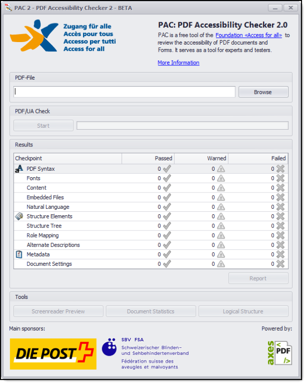
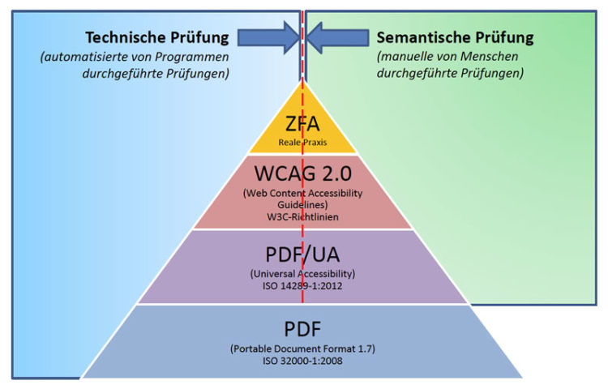

Letzte Woche ist die [Schweizer Accessibility-Studie 2016](https://www.access-for-all.ch/ch/aktuell-sp-19351/518-schweizer-accessibility-studie-2016.html) der Stiftung [Zugang für alle](http://www.access-for-all.ch/ch/) erschienen. Sie untersucht Webauftritte öffentlicher Institutionen, also Webseiten von Departementen, Kantonen und grösseren Städten sowie Hochschulen und Newsportalen. Ein auffällig konstantes Manko ist die Zugänglichkeit von PDF-Dokumenten.

## Ausgangslage

Das [Portable Document Format (kurz: PDF)](https://de.wikipedia.org/wiki/Portable_Document_Format) ist eines der beliebtesten und weitverbreitetsten Dateiformate überhaupt. PDFs werden in der professionellen Druckvorstufe, sowie auch als plattformunabhängiges Austauschformat im Web verwendet.

Im Web können PDFs als Ergänzung zu HTML-Inhalten zur Verfügung gestellt werden. Dies wird vor allem gemacht um eine zusätzliche druckoptimierte Version anzubieten. Mit «druckoptimiert» ist hier ein starres Layout mit fix definierten Dimensionen und Umbrüchen gemeint.

Vielfach werden Informationen jedoch nur in Form eines PDFs angeboten. Das können Publikationen, wie Broschüren und Flyer, Pläne, Geschäftsdokumente oder auch Formulare sein. Bis hierhin gibt’s noch kein Problem, da Suchmaschinen PDFs nicht abwertend behandeln und diese in der Regel auch direkt im Browser geöffnet werden können.

Nun zum kritischen Teil – der schlechten Zugänglichkeit vieler PDFs. Hier sind vier Gründe wieso PDFs nicht barrierefrei erstellt werden:

- Ersteller von PDFs sind vielfach nicht dieselben wie die Verantwortlichen der HTML-Inhalte. PDFs werden nicht als Webinhalte wahrgenommen und dementsprechend behandelt.
- Dokumente und Publikationen werden nicht medienneutral hergestellt und es fehlt die Sensibilisierung für die Barrierefreiheit (Grafikdesign, Druckvorstufe, Redaktionen, Fachverantwortliche).
- Es werden keine Massnahmen getroffen, da es als zu aufwendig, zu teuer, zu technisch oder als unnötig empfunden wird.
- Beliebte Textverarbeitungs- oder [DTP](https://de.wikipedia.org/wiki/Desktop-Publishing)\-Software erleichtern den Benutzern die Erstellung eines barrierefreien PDFs nach PDF/UA-1 (noch) zu wenig.

## Barrieren

### Assistive Technologien (AT)

Obwohl die Digitalisierung vielen behinderten Menschen mehr Möglichkeiten verschaffen hat, werden vielfach zusätzliche Hilfsmittel benötigt um diese Informationen auch lesen und verarbeiten zu können. Diese Hilfsmittel nennt man assistive Technologien (Abk.: AT) und können Software wie auch Hardware sein. Zu den folgenden Barrieren werden einige AT als Beispiele genannt.

### Sehbehinderung

In der Schweiz werden 320 000 Sehbehinderte geschätzt, wovon 10 000 als blind gelten (Quelle: [Schweizerischer Zentralverein für das Blindenwesen](http://www.szb.ch/footer/service/infothek/die-wichtigsten-fragen-zu-sehbehinderung-und-blindheit/)). Eine vereinfachte Umschreibung wer als Sehbehindert gilt: Normaler Zeitungsdruck kann auch mit einer Lesebrille oder Kontaktlinsen nicht mehr gelesen werden.

Nebst dem unscharfen Sehen, können Sehbehinderte auch unter folgenden Symptomen leiden:

- Gesichtsfeldausfälle, Tunnelblick
- Doppelbilder, Flimmern, Blitzen oder Blendungen
- helle Punkte, verschleierte, verschwommene oder verzerrte Bilder

Damit sehbehinderte und blinde Menschen Inhalte auf einem Bildschirm trotzdem lesen können, werden sie von Bildschirmlupen, Screenreader (Bildschirmlesegerät) und der elektronischen Braille-Zeile unterstützt.

https://www.youtube.com/watch?v=-lxQD9I5xIQ

### Farbenfehlsichtigkeit

Die häufigste Form ist die Rot/Grün-Sehschwäche, wovon ca. 8% der Männer und ca. 0,5% der Frauen betroffen sind. Betroffene nehmen dabei mehrere Farbbereiche gleich oder sehr ähnlich wahr. Eine weit seltenere Form ist die totale Farbblindheit, bei der nur noch helle und dunkle Kontraste wahrgenommen werden können.

Die Berücksichtigung von Farbensehschwäche beginnt bereits bei der Erstellung und Gestaltung der Inhalte. Es ist zu beachten, dass kombinierende Farben genügend Kontraste aufweisen. Ein Tool um zu prüfen ob genügend Kontraste vorhanden sind, ist der [Colour Contrast Analyzer (CCA).](https://www.paciellogroup.com/resources/contrastanalyser/)

Quelle der Grafik: [Understanding Color Blindness: A Guide to Accessible Design](http://www.cruxcollaborative.com/understanding-color-blindness-guide-to-accessible-design/)

Zudem darf das Darstellen von Unterschieden nicht rein durch Farbe visualisiert werden. Beispielsweise dürfen positive und negative Prozentwerte nicht nur durch grüner und roter Textfarbe, sondern zusätzlich mit Zeichen oder Pfeile kenntlich gemacht werden.

### Motorische Behinderungen

Durch Unfälle oder Krankheit wird es Menschen verunmöglicht eine gewöhnliche Maus oder Tastatur zu benutzen – sie sind motorisch eingeschränkt. Um dem entgegenzuwirken werden Geräte beispielsweise per Sprach-, Mund-, Augensteuerung oder mit Spezialmäusen und Spezialtastaturen bedient.

### Sprachliche Barrieren

Sprachliche Barrieren sind fremdsprachige oder unverständliche, komplizierte Texte (hoffe dies trifft nicht auf diesen Artikel zu :-). Dazu kommen auch Lese-, Rechtschreibe- und Lernschwächen.

### Gehörlosigkeit

Hörbeeinträchtigte Menschen sind ist den meisten Fällen nicht von den Barrieren in PDFs betroffen. Dies weil multimediale Inhalte, wie Tonaufnahmen und Videos, selten in PDFs verwendet werden. Diese Art der Inhalte werden meist direkt auf Webseiten platziert.

Technisch wäre es jedoch möglich, weshalb auch diese Inhalte optimiert werden sollten. Für Tonaufnahmen wäre dies ein zusätzlich vorhandenes Transkript (Töne und Gesprochenes in Textform) und bei Videoaufnahmen wären dies Untertitel oder auch zusätzliche Gebärdenspracheaufnahmen.

### Zielgruppe(n)

Die Vielfalt von Behinderungen und die Anzahl Betroffener ist gross:

> 20% der Schweizer sind von der digitalen Welt ausgeschlossen  
> 20% potentielle Kunden
> 
> Zugang für alle, Schweizer Accessibility-Studie 2016

Diese Zahl ist beeindruckend – oder nicht? Aber nicht nur dies – Verbesserungen der Barrierefreiheit haben auch noch weitere positiven Auswirkungen und betreffen alle:

- Bessere Usability (Benutzbarkeit), insbesondere die Verwendung auf mobilen Geräten;
- Bessere Positionierung in Suchmaschinen (SEO);
- Durch Anwendung von Standards wird die Kompatibilität erhöht;

## Richtlinien

### Der Standard PDF/UA-1

Der [ISO-Standard 14289-1](http://www.iso.org/iso/catalogue_detail.htm?csnumber=54564) (PDF/UA) ist im Jahr 2012 in seiner ersten Version erschienen. Verantwortlich dafür ist die Organisation [PDF Association](https://www.pdfa.org/?lang=de), welche unter anderem auch für die Standards PDF, PDF/A und PDF/X zuständig sind. Der Inhalt dieses ISO-Standards ist kostenpflichtig erhältlich (ich habe ihn nie gesehen).

### Matterhorn Protokoll

Eine kostenlose Lösung, um die Konformität von PDF/UA zu überprüfen, ist das [Matterhorn Protokoll](https://www.pdfa.org/wp-content/until2016_uploads/2016/08/MatterhornProtokoll_1-02-2016-06-29.pdf). Es kann auf der Webseite der PDF Association heruntergeladen werden und wurde auch ins Deutsche übersetzt. Dieses Dokument hilft Softwareentwicklern und Testpersonen die PDF/UA-Konformität zu prüfen.

Darin werden 136 Fehlerbedingungen, unterteilt in 31 Prüfpunkten, erläutert. Diese werden wiederum in 87 Fehlerbedingungen aufgeteilt, welche durch Software automatisch überprüft werden können. 47 Fehlerbedingungen müssen manuell und interaktiv geprüft werden. 2 Fehlerbedingungen werden nicht zugeordnet.

### WCAG 2.0

Die [Web Content Accessibility Guidelines (WCAG)](https://www.w3.org/Translations/WCAG20-de/) sind die offiziellen Richtlinien des [W3C (World Wide Web Consortium)](https://www.w3.org/) für barrierefreie Webinhalte. Sie sind erhältlich in der zweiten Version aus dem Jahr 2008. Sie beschreiben, wie es der Name verrät, den Umgang aller Auszeichnungs- und Programmiersprachen des Webs und wie die Inhalte barrierefrei erzeugt werden.

Das PDF-Format wird auch als Beispiel der möglichen Webinhalte genannt, weshalb die Richtlinien auch für PDFs gelten. Die Richtlinien sind aber generell gehalten, weshalb nicht jeder Punkt zum PDF-Format passt. Da Barrierefreiheit mit dem PDF/UA-Standard nicht neu erfunden wurde, basiert dieser auf den WCAG.

## Testen mit PAC 2

Das wohl umfangreichste und bekannteste Tool um PDFs auf dessen Barrierefreiheit zu testen, ist PAC 2. Es wurde von der Firma xyMedia entwickelt und wird von der Schweizer Stiftung [Zugang für alle](http://www.access-for-all.ch/ch/pdf-werkstatt/pdf-accessibility-checker-pac.html) vertrieben.

Es kann kostenlos heruntergeladen und verwendetet werden ([Donationware](https://de.wikipedia.org/wiki/Donationware)). Obwohl im DTP-Bereich vielfach mit einem Mac-Betriebssystem gearbeitet wird, läuft PAC zurzeit leider nur auf einem Windows-System. Auf Mac und Linux Rechnern muss daher mit einer Virtualisierungssoftware gearbeitet werden.

Beim Testen eines PDFs wird zwischen zwei Arten unterschieden,

- der technischen (automatisch durch Software) und
- der semantischen (interaktiv durch einen Menschen)

Prüfung. Die Prüfkriterien von PAC 2 basieren auf genannten Matterhorn Protokoll.

Bei der technischen Überprüfung werden nebst dem PDF/UA-Standard auch die Konformität des PDF-Standards, WCAG und zusätzliche Punkte kontrolliert.

Quelle der Grafik: Blog der Stiftung Zugang für alle.

Wie bereits genannt, ist das Testen nach der automatischen Prüfung noch nicht beendet. Jetzt wird die Semantik überprüft. Diese interaktive Prüfung kann mit der Screenreader-Vorschau von PAC 2 oder direkt mit assistiven Technologien getestet werden.

Fehler, welche durch diese Prüfung aufgedeckt werden:

- Inhalte/Objekte ohne Informationsgehalt sind als realer Inhalt getaggt,
- Inhalte mit Informationsgehalt werden nicht getaggt / als Artefakt gekennzeichnet,
- falsche Lesereihenfolge,
- falsche oder nicht vorhandene Überschriften-Tags,
- falsche oder nicht vorhandene Überschriften-Zellen innerhalb von Tabellen,
- inkorrekte Fussnoten,
- falsche Metadaten,
- usw.

## Fazit

Auch nach dem Lesen dieses Artikels kann für die Eine oder den Anderen dieses Thema noch etwas technisch und kompliziert sein. Es war auch sehr theoretisch. Ich plane noch weitere Artikel dazu zu schreiben und die praktische Arbeit noch etwas mehr zu beleuchten.

Soviel vorneweg – ein wichtiger Teil ist die strukturierte Dokumenterstellung. Alle, die sich bisher um die Verwendung von Formatvorlagen gedrückt haben – jetzt ist ein guter Zeitpunkt damit anzufangen.

## Ressourcen

- [Übersetztes Matterhorn Protokoll – PDF Association](https://www.pdfa.org/wp-content/until2016_uploads/2016/08/MatterhornProtokoll_1-02-2016-06-29.pdf)
- [PAC 2 – Zugang für alle](http://www.access-for-all.ch/ch/pdf-werkstatt/pdf-accessibility-checker-pac.html)
- [Übersetzte WCAG 2.0 – World Wide Web Consortium (W3C)](https://www.w3.org/Translations/WCAG20-de/)
- [Schweizer Accessibility-Studie 2016 – Zugang für alle](http://www.access-for-all.ch/images/Accessibilty_Studie/2016/SchweizerAccessibilityStudie2016.pdf)

<iframe src="//slides.com/pixelstrolch/barrierefreie-pdfs/embed?style=light" width="747" height="500" allowfullscreen="allowfullscreen"></iframe>
